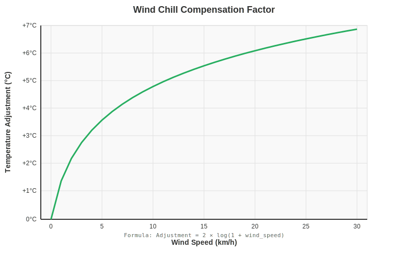
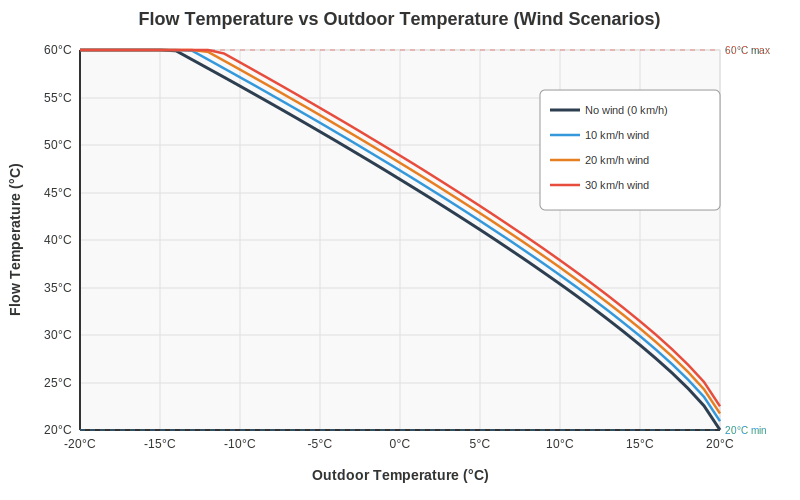
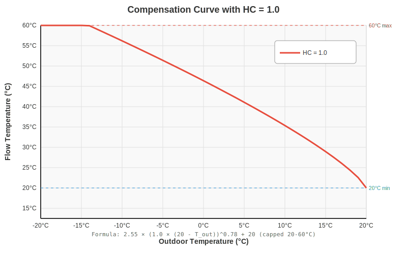

# CompCurve

Temperature compensation curve equation for home heating system with Home Assistant integration.

## Home Assistant Helper Equation

```python
{{ min(60, max(20,
    2.55 * (1.0 * max(0, 20 - float(states('sensor.gw3000a_outdoor_temperature')))) ** 0.78 + 20
    + 0.1178 * float(states('sensor.average_wind_speed_hourly')) ** 0.898
)) | round(0) }}
```

## What is a Compensation Curve?

A compensation curve (also known as a weather compensation curve) automatically adjusts your heating system's flow temperature based on outdoor temperature. This ensures:

- Optimal comfort levels
- Energy efficiency
- Reduced heating costs
- Consistent indoor temperatures

### How It Works

- **Lower outdoor temperatures** → Higher heating flow temperatures
- **Higher outdoor temperatures** → Lower heating flow temperatures

## Formula Breakdown

**Base Formula:**<br>
`TFlow = 2.55 × (HC × (Tset - Tout))^0.78 + Tset + WindAdjustment`

### Components

1. **Non-linear base calculation**: `2.55 × (HC × (Tset - Tout))^0.78 + Tset`
   - **HC** = Heat Curve parameter = 1.0 (adjustable 0.8-1.5)
   - **Tset** = Set/comfort temperature = 20°C
   - **0.78** = Exponent matching radiator physics
   - **2.55** = Scaling constant from Vaillant heat pump analysis
   - Creates a curved response that matches how radiators actually transfer heat

2. **Wind chill compensation**: `+ 0.1178 × wind_speed^0.898`
   - Adds extra heating when windy (wind increases heat loss)
   - Power law provides gradual increase with diminishing returns
   - Typically adds 0-2.5°C depending on conditions (see graph below)
   - Tuned for +0.5°C at 5 km/h and +2.5°C at 30 km/h

3. **Safety limits**: `min(60, max(20, ...))`
   - **Minimum**: 20°C (prevents system shutdown)
   - **Maximum**: 60°C (protects components and prevents scalding)

4. **Rounding**: `| round(0)` → whole degree output

## Why Non-Linear?

Radiator heat output is non-linear due to two heat transfer mechanisms:
- **Radiation**: Linear relationship to temperature difference
- **Convection**: Non-linear due to variable air flow speeds (chimney effect)

The 0.78 exponent compensates for this physics, ensuring heating power remains proportional to the actual heating need across all conditions.

## Compensation Curve Visualization


The graph shows the non-linear relationship between outdoor and flow temperatures for three different Heat Curve (HC) parameter values:

- **HC = 0.8 (Conservative)**: Milder heating, lower flow temperatures
- **HC = 1.0 (Default)**: Recommended balance for most systems
- **HC = 1.5 (Aggressive)**: Higher flow temperatures, more intense heating

Notice all curves are steeper at lower temperatures (more aggressive heating when cold) and flatten as they approach indoor comfort levels. The HC parameter shifts the entire curve up or down without changing its fundamental shape.

## Wind Adjustment Visualization



The wind adjustment follows a power law curve, providing moderate compensation that increases gradually with wind speed. This gives +0.5°C at 5 km/h and +2.5°C at 30 km/h, matching real-world observations of wind-induced heat loss.

## Temperature Reference Table

| Outdoor Temp | Flow Temp (no wind) | 10 km/h wind | 20 km/h wind | 30 km/h wind |
|--------------|---------------------|--------------|--------------|--------------|
| -20°C        | 60.0°C (max)        | 60.0°C (max) | 60.0°C (max) | 60.0°C (max) |
| -10°C        | 56.2°C              | 57.1°C       | 57.9°C       | 58.7°C       |
| -5°C         | 51.4°C              | 52.3°C       | 53.1°C       | 53.9°C       |
| 0°C          | 46.4°C              | 47.3°C       | 48.1°C       | 48.9°C       |
| 5°C          | 41.1°C              | 42.0°C       | 42.8°C       | 43.6°C       |
| 10°C         | 35.4°C              | 36.3°C       | 37.1°C       | 37.9°C       |
| 15°C         | 28.9°C              | 29.9°C       | 30.7°C       | 31.4°C       |
| 20°C         | 20.0°C (min)        | 20.9°C       | 21.7°C       | 22.5°C       |



The graph visualizes all values from the table above, showing how flow temperature varies with outdoor temperature across four wind scenarios. Notice how the curves are parallel, with wind adding a consistent offset across all outdoor temperatures.

## Adjusting the Curve

To make the heating more or less aggressive, adjust the **HC** (Heat Curve) parameter:

- **HC = 0.8**: Conservative, milder heating
- **HC = 1.0**: Recommended balance (default)
- **HC = 1.5**: Aggressive, hotter heating

Example for HC=0.75:
```python
{{ min(60, max(20,
    2.55 * (0.75 * max(0, 20 - float(states('sensor.gw3000a_outdoor_temperature')))) ** 0.78 + 20
    + 0.1178 * float(states('sensor.average_wind_speed_hourly')) ** 0.898
)) | round(0) }}
```



## Reference

Formula based on Vaillant heat pump compensation curve analysis:<br>
[Vaillant Heat Pump Controls: The Heat Curves](https://protonsforbreakfast.wordpress.com/2024/10/16/vaillant-heat-pump-controls-part-1-the-heat-curves/)

## Previous Linear Version

The original linear formula (`48 - outdoor_temp`) has been replaced with this non-linear version for better efficiency and radiator physics matching. See git history for the previous implementation.
