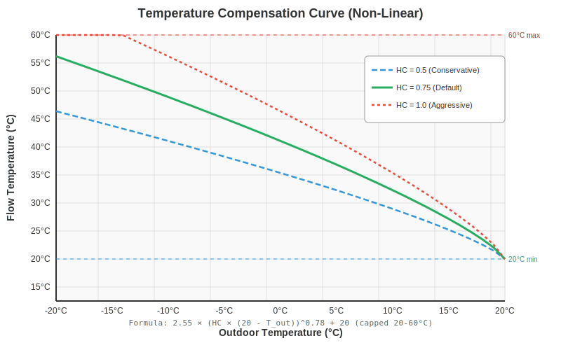

# CompCurve

A simple project to manage a temperature compensation curve equation for home heating.

## Overview

This project manages the temperature compensation curve used to optimize heating system performance based on outdoor temperature conditions.

## What is a Compensation Curve?

A compensation curve (also known as a weather compensation curve) is used in heating systems to automatically adjust the flow temperature of the heating system based on the outdoor temperature. This ensures:

- Optimal comfort levels
- Energy efficiency
- Reduced heating costs
- Consistent indoor temperatures

## How It Works

The compensation curve typically follows a relationship where:
- Lower outdoor temperatures → Higher heating flow temperatures
- Higher outdoor temperatures → Lower heating flow temperatures

The curve is usually defined by parameters such as:
- **Curve slope**: How aggressively the system responds to outdoor temperature changes
- **Parallel shift**: Offset to adjust the overall temperature level
- **Design temperature**: The lowest expected outdoor temperature
- **Maximum flow temperature**: Upper limit for the heating system

# Home Assistant Helper Equation

```python
{{ min(60, max(20, 48 - float(states('sensor.gw3000a_outdoor_temperature')) + 2 * log(1 + float(states('sensor.average_wind_speed_hourly'))))) | round(0) }}
```

## Equation Analysis

**Formula breakdown:**
```
Target Temperature = min(60, max(20, 48 - outdoor_temp + 2 * log(1 + wind_speed)))
```

### Components

1. **Base calculation**: `48 - outdoor_temp`
   - When outdoor temp = 0°C → flow temp = 48°C
   - When outdoor temp = 20°C → flow temp = 28°C
   - This creates a **1:1 inverse slope** (for every 1°C drop outside, add 1°C to flow temperature)

2. **Wind chill compensation**: `+ 2 * log(1 + wind_speed)`
   - Adds extra heating when it's windy (wind increases heat loss)
   - Uses logarithmic scale so the effect diminishes as wind speed increases
   - The `+1` prevents log(0) errors and softens the initial response
   - Multiplier of `2` amplifies the wind effect

3. **Safety limits**: `min(60, max(20, ...))`
   - **Minimum**: 20°C (prevents system from turning off completely)
   - **Maximum**: 60°C (protects system components and prevents scalding)

4. **Rounding**: `| round(0)` → whole degree output

### Example Scenarios

- **Mild day** (15°C, 5 km/h wind): `48 - 15 + 2*log(6)` ≈ **36°C**
- **Cold calm day** (0°C, 0 km/h wind): `48 - 0 + 2*log(1)` = **48°C**
- **Cold windy day** (0°C, 20 km/h wind): `48 - 0 + 2*log(21)` ≈ **54°C**
- **Very cold windy** (-5°C, 30 km/h wind): Would calculate to ~60°C but capped at **60°C**

### Characteristics

- **Curve center point**: 48°C at 0°C outdoor temp
- **Wind sensitivity**: Good - logarithmic response prevents over-compensation
- **Conservative design**: The 1:1 slope is relatively gentle (some systems use steeper curves like 1.5:1)

## Compensation Curve Graph

The following graph shows the base compensation curve (without wind chill compensation):



**Base formula**: Flow Temp = 48 - Outdoor Temp<br>
**Active range**: -10°C to 28°C outdoor (before hitting limits)<br>
**Capped range**: 20°C minimum, 60°C maximum

### Key Points on the Curve

| Outdoor Temp | Calculated Flow Temp | Actual (after limits) |
|--------------|---------------------|----------------------|
| -10°C        | 58°C                | 58°C                 |
| -5°C         | 53°C                | 53°C                 |
| 0°C          | 48°C                | 48°C                 |
| 5°C          | 43°C                | 43°C                 |
| 10°C         | 38°C                | 38°C                 |
| 15°C         | 33°C                | 33°C                 |
| 20°C         | 28°C                | 28°C                 |
| 25°C         | 23°C                | 23°C                 |
| 30°C         | 18°C                | 20°C (min cap)       |

**Note**: Wind speed adds 0-6°C to these values depending on conditions (see wind compensation formula above).
